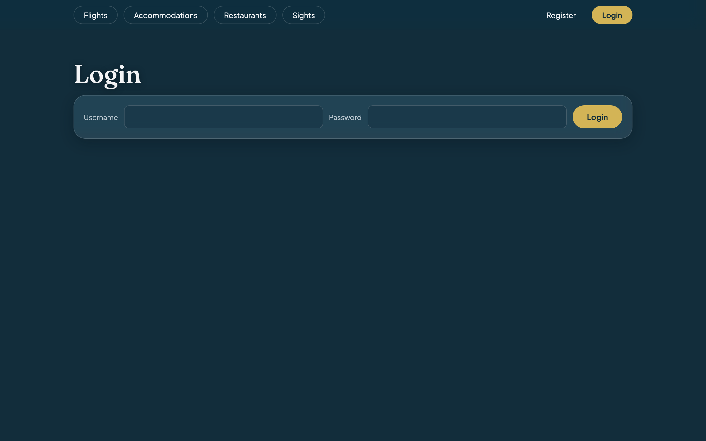
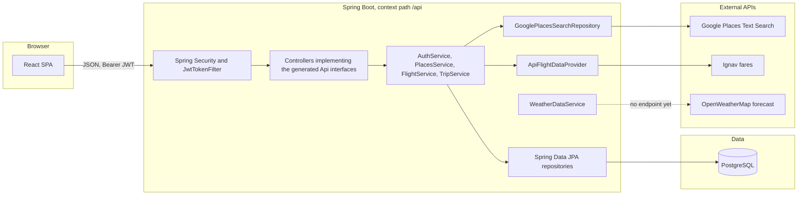

<div align="center">
  
  <h1>✈️ Travel Planner</h1>
  <p>Pick a city, find a flight, and keep the hotels, restaurants and sights you like in one trip.</p>

<a href="https://adoptium.net/temurin/releases/"></a> <a href="https://spring.io/projects/spring-boot"></a> <a href="https://www.openapis.org/"></a> <a href="https://react.dev"></a>
<a href="https://vite.dev"></a> <a href="https://www.postgresql.org/"></a> <a href="https://www.docker.com/"></a> <a href="https://jwt.io/"></a><br><br>
<a href="https://github.com/bucystoni/travel-planner/actions/workflows/ci.yml"></a>
</div>

<details>
  <summary>Table of contents</summary>

- [About the project](#-about-the-project)
- [Built with](#-built-with)
- [Features](#-features)
- [Getting started](#-getting-started)
- [How it works](#-how-it-works)
- [API](#-api)
- [Configuration](#-configuration)
- [Tests and CI](#-tests-and-ci)
- [Team](#-team)

</details>

## 📖 About the project

Travel Planner puts the trip planning in one place. You pick a city, find a flight, and then collect hotels, restaurants and sights for that destination into a trip you can come back to later.

We built it as a Codecool team project: a Spring Boot API on one side, a React app on the other, and a Postgres database holding it all together. Accounts use stateless JWTs: login checks your password against its BCrypt hash and returns a signed token, which the React app keeps in `localStorage` and sends as a Bearer header on every request.

It's an ongoing project, so not everything is done yet. 

<p align="center"></p>

## 🧰 Built with

- [](https://adoptium.net/temurin/releases/) 
- [](https://spring.io/projects/spring-boot) 
- [](https://spring.io/projects/spring-security) 
- [](https://spring.io/projects/spring-data-jpa) 
- [](https://www.openapis.org/) 
- [](https://openapi-generator.tech/) 
- [](https://jwt.io/)
- [](https://www.postgresql.org/) 
- [](https://react.dev) 
- [](https://reactrouter.com/) 
- [](https://vite.dev) 
- [](https://vitest.dev/)
- [](https://developers.google.com/maps/documentation/places/web-service) 
- [](https://openweathermap.org/api)
- [](https://www.docker.com/) 
- [](https://github.com/features/actions) 
- [](https://render.com) 
- [](https://neon.tech) 
- [](https://pages.cloudflare.com)

## ✨ Features

- Destination search: type a city on the landing page and the backend checks the database first, asking Google Places only for cities it hasn't seen before. Then the app sends you on to flights with that city filled in.
- Flight search: two airport fields autocomplete in the browser against a bundled list of about 7,900 airports, and `GET /flights` asks Ignav's one-way fares endpoint for offers on your date. Each result card shows the price, total duration, cabin class, stops and every segment, and warns you when a connection needs a self-transfer.
- Hotels, restaurants and sights: each page searches by city, calls Google Places only when nothing is stored yet and saves what comes back, so the second person to look at Rome doesn't cost us another API call.
- Trips: saving a flight creates a trip, after which every place card for that city gets a "Save to my trip" button. The trip you're working on survives a page refresh, and My trips lets you delete an old one or activate it again with Continue.
- Accounts: register with a username, email and password; everyone gets `ROLE_USER`. On first startup the backend creates an `admin` account using `ADMIN_PASSWORD`.
- Weather: `WeatherDataService` fetches the OpenWeatherMap 5-day, 3-hour forecast, but it has no endpoint or UI yet.

## 🚀 Getting started

### Prerequisites

For the recommended Docker route you only need the first two. The other three are for running without Docker.

| Tool | Why you need it | Check it's installed |
|---|---|---|
| [](https://www.docker.com/products/docker-desktop/) | Runs the database, backend and frontend in containers, so you don't install Java or Node yourself. | `docker compose version` |
| [](https://git-scm.com/downloads) | Downloads the code from GitHub. | `git --version` |
| [](https://adoptium.net/temurin/releases/?version=25) | Builds and runs the backend. Maven comes with the repo (`./mvnw`), so you don't install it. | `java -version` |
| [](https://nodejs.org/en/download) | Runs the frontend. Vite 8 wants 20.19+ or 22.12+. | `node -v` |
| [](https://www.postgresql.org/download/) | The database the backend stores everything in. | `psql --version` |

### API keys you'll need

- A Google Places key: [get one here](https://developers.google.com/maps/documentation/places/web-service/get-api-key).
- An Ignav API key from the provider. Our backend talks to `https://ignav.com/api`.
- An OpenWeatherMap key: [get one here](https://home.openweathermap.org/api_keys).

The backend refuses to start without all three, even the OpenWeatherMap one, because their config classes read them with no fallback.

### Get the code

```bash
git clone https://github.com/bucystoni/travel-planner.git
cd travel-planner
```

If you have an SSH key on GitHub you can use `git@github.com:bucystoni/travel-planner.git` instead.

### Run with Docker (recommended)

```bash
cp .env.example .env
# open .env in a text editor and replace every value with your own
docker compose up --build
```

In `.env`, `DB_USERNAME` and `DB_PASSWORD` can be anything you like, since Compose uses them to create the Postgres user. Paste your three API keys, pick an `ADMIN_PASSWORD`, and generate the JWT secret with `openssl rand -base64 32`. You can leave `APP_CORS_ALLOWED_ORIGINS` empty, because Compose sets it to `http://localhost:3000` for you. The first build takes a few minutes. When it's done, open http://localhost:3000 and you should see the landing page from the screenshot above: a search box asking where you'd like to go, with Flights, Accommodations, Restaurants, Sights, Register and Login in the menu. Press `Ctrl+C` in the terminal to stop it.

Compose builds and starts three services, each one waiting until the previous one reports healthy:

| Service | What runs | Port on your machine |
|---|---|---|
| `db` | `postgres:17-alpine` with a `travel_planner` database on a named volume | not published |
| `backend` | the Spring Boot jar on Eclipse Temurin 25, health-checked at `/api/actuator/health` | 8080 |
| `frontend` | the Vite build served by nginx, built against `http://localhost:8080/api` | 3000 |

### Run without Docker

Create a database called `travel_planner` and export these variables in the terminal you'll run the backend from. Hibernate creates the tables on first run (`ddl-auto=update`).

```bash
SPRING_DATASOURCE_URL=jdbc:postgresql://localhost:5432/travel_planner
DB_USERNAME=<your db username>
DB_PASSWORD=<your db password>
APP_CORS_ALLOWED_ORIGINS=http://localhost:5173
GOOGLE_API_KEY=<your Google Places key>
IGNAV_API_KEY=<your Ignav key>
OPENWEATHER_API_KEY=<your OpenWeatherMap key>
TRAVEL_PLANNER_JWT_SECRET=<Base64-encoded secret, at least 32 bytes>
TRAVEL_PLANNER_JWT_EXPIRATION_MS=86400000
ADMIN_PASSWORD=<password for the seeded admin account>
PORT=8080
```

```bash
cd backend
./mvnw spring-boot:run
```

The API comes up on `http://localhost:8080/api`. In a second terminal:

```bash
cd frontend
npm install && npm run dev
```

The app runs on http://localhost:5173. The committed `frontend/.env.development` already points `VITE_API_URL` at the local backend, and 5173 is the backend's default CORS origin, so the two find each other without extra setup.

### Something not working?

- The backend stops at startup complaining it can't resolve a placeholder like `GOOGLE_API_KEY`: one of the three API keys is missing. Set all three, even if you don't care about weather.
- The database login fails: the variables are `DB_USERNAME` and `DB_PASSWORD`, not `SPRING_DATASOURCE_USERNAME` and `SPRING_DATASOURCE_PASSWORD`.
- The frontend shows a blank page and the browser console says `VITE_API_URL` is not set: Vite bakes that variable in at build time, and `src/api/client.js` throws on load without it.

## 🧭 How it works



Contract-first, in plain words: `backend/src/main/resources/openapi/travel-planner-api.yaml` is the source of truth for the API. Every Maven build runs the OpenAPI generator on it and produces Java interfaces and request/response classes, and our controllers implement those interfaces, so if a controller drifts from the spec, the build breaks. Behind the controllers, the services hold the logic, the repositories fetch and store data (Spring Data JPA for Postgres, thin clients for Google Places and Ignav), and `GlobalExceptionHandler` turns our exceptions into `ProblemDetail` responses such as 404 for an unknown city or 502 when an external API fails. Want to change the API? Edit the YAML first and let the compiler show you what needs to follow.

## 🔌 API

Everything sits under `/api` (for example `http://localhost:8080/api/trips`). Authenticated routes expect an `Authorization: Bearer <jwt>` header.

| Group | Method | Path | Auth | Purpose |
|---|---|---|---|---|
| Auth | POST | `/auth/register` | Public | Create an account with username, email and password |
| Auth | POST | `/auth/login` | Public | Log in with a username (or an email if the username is blank) and get a JWT |
| Destinations | GET | `/destinations?name=` | Public | Look up a city by name |
| Flights | GET | `/flights?departureIataCode=&destinationIataCode=&date=` | Public | One-way flight offers for a date |
| Places | GET | `/accommodations?destinationName=` | Public | Hotels in a city |
| Places | GET | `/restaurants?destinationName=` | Public | Restaurants in a city |
| Places | GET | `/sights?destinationName=` | Public | Tourist attractions in a city |
| Trips | GET | `/trips` | `ROLE_USER` | Your saved trips |
| Trips | POST | `/trips` | `ROLE_USER` | Create a trip |
| Trips | GET | `/trips/{id}` | `ROLE_USER` | One of your trips |
| Trips | PUT | `/trips/{id}` | `ROLE_USER` | Replace a trip's flight, places and dates |
| Trips | DELETE | `/trips/{id}` | `ROLE_USER` | Delete one of your trips |
| Admin | GET | `/admin/trips` | `ROLE_ADMIN` | Every trip from every user |
| Ops | GET | `/actuator/health` | Public | Health check used by Docker Compose |


## ⚙️ Configuration

| Variable | Required | Default | Used for |
|---|---|---|---|
| `SPRING_DATASOURCE_URL` | Yes | none | JDBC URL of the Postgres database (Compose sets it for you) |
| `DB_USERNAME` | Yes | none | Database user |
| `DB_PASSWORD` | Yes | none | Database password |
| `APP_CORS_ALLOWED_ORIGINS` | No | `http://localhost:5173` | Comma-separated list of frontend origins allowed to call the API |
| `GOOGLE_API_KEY` | Yes | none | Google Places Text Search |
| `IGNAV_API_KEY` | Yes | none | Ignav flight fares |
| `OPENWEATHER_API_KEY` | Yes | none | OpenWeatherMap forecast |
| `TRAVEL_PLANNER_JWT_SECRET` | Yes | none | HMAC key for signing JWTs, Base64-encoded |
| `TRAVEL_PLANNER_JWT_EXPIRATION_MS` | No | `86400000` (24 hours) | Token lifetime in milliseconds |
| `ADMIN_PASSWORD` | Yes | none | Password of the `admin` account created on first startup |
| `PORT` | No | `8080` | HTTP port the backend listens on |

Watch out: the database credentials are `DB_USERNAME` and `DB_PASSWORD`, not `SPRING_DATASOURCE_USERNAME` and `SPRING_DATASOURCE_PASSWORD`. `application.properties` maps them explicitly, and Compose reuses the same two names for the Postgres container.

On the frontend there's one variable, `VITE_API_URL`, the API's base URL including `/api`. Vite bakes it in at build time, and `src/api/client.js` throws on load if it's missing, so a page built without it fails loudly in the browser console instead of quietly calling the wrong server.

## 🧪 Tests and CI

Run `./mvnw test` in `backend` and `npm test` in `frontend`. That's 20 backend tests in 10 classes: five `@SpringBootTest` integration classes that drive the API through MockMvc (login, registration, admin access, trip authorization and the places cache) and five unit test classes built on Mockito or `MockRestServiceServer`. The frontend has 2 Vitest and Testing Library tests, one for the app's routing and one for a successful login. Backend tests run on an in-memory H2 database with dummy keys, there's no Testcontainers, and none of them touch a real external API. `.github/workflows/ci.yml` runs on every pull request into `development`, on every push to `development` and by hand via `workflow_dispatch`, with a backend job (Temurin JDK 25, `./mvnw -B test`) and a frontend job (Node 22, `npm ci`, `npm run lint`, `npm test`, `npm run build`) running in parallel. In production the backend runs on Render, the database on Neon and the frontend on Cloudflare Pages.

## 👥 Team

- Telegdy Luca
- Bucys Antanas
- Khern Kira
- Kovács Márton

Project link: [github.com/bucystoni/travel-planner](https://github.com/bucystoni/travel-planner)
